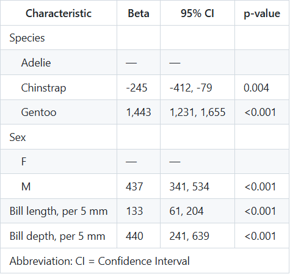

<!-- README.md is generated from README.Rmd. Please edit that file -->

```{r, include = FALSE}
knitr::opts_chunk$set(
  collapse = TRUE,
  comment = "#>",
  fig.path = "man/figures/README-",
  out.width = "100%"
)
```

# pericircle

<!-- badges: start -->
<!-- badges: end -->

A slice of Perisphere, `pericircle` aims to allow straightforward application of our principals for project organization. These principals are:

1. Readable code.
1. Minimal redundancy.
1. Consistent presentation.

## Installation

You can install the development version of `pericircle` from [GitHub](https://github.com/) with:

``` r
# install.packages("pak")
pak::pak("perisphere-rwe/pericircle")
```

## Data dictionaries

Dictionaries help organize pertinent information about analytic variables, putting information about each variable into tables and figures using consistent labels and incorporating additional information when appropriate. 

There are two ways to initialize a dictionary. You can build them using `NumericVariable` and `NominalVariable` objects (not shown here, see vignette), but this can be tedious if you have a lot of variables. For most cases, you'll want to use the `as_data_dictionary()` to create a starter dictionary from a given dataset.

```{r, message=FALSE}

library(pericircle)
library(tidyverse)
library(palmerpenguins)

data_peng <- penguins %>% 
  select(species, sex, body_mass_g, bill_length_mm, bill_depth_mm)

dd_peng <- as_data_dictionary(data_peng)

dd_peng

```

### Tell me what I don't know

Our dictionary is initialized, but it doesn't contain complete information yet. Where should we start? Use the function `get_unknowns()` to clarify what relevant information is missing. This function returns a `tibble` by default, but if you set `as_request = TRUE`, it provides a bullet point list that is easier to read. If you work with subject matter experts, you can also send this text to them and ask for help filling in the gaps.

```{r}
get_unknowns(dd_peng, as_request = TRUE)
```

### Modify dictionary values

Once we have this information ready to embed in the dictionary, we can use `pericircles` family of `set` functions:

```{r}

dd_peng <- dd_peng %>% 
  set_labels(species = "Species",
             sex = "Sex",
             bill_length_mm = "Bill length",
             bill_depth_mm = "Bill depth") %>% 
  set_units(bill_length_mm = "mm",
            bill_depth_mm = "mm",
            body_mass_g = "grams") %>% 
  set_divby_modeling(bill_length_mm = 5,
                     bill_depth_mm = 5)

```

#### Modifying factors

Modify factor labels, changing one or more labels in an existing variable, with `set_factor_labels()`:

```{r}

dd_peng$variables$sex

dd_peng <- dd_peng %>% 
  set_factor_labels(sex = c(female = "F", male = "M"))

dd_peng$variables$sex

```

Modify factor order, moving one or more levels to the front, with `set_factor_order()`:

```{r}

dd_peng <- dd_peng %>% 
  set_factor_order(sex = c("female"))

dd_peng$variables$sex

```

### Apply dictionary information

Data dictionaries have a method called `recode()`, which leverages the `dplyr::recode()` function in combination with information stored in the dictionary to provide a 'smart' recoder. The 'smart' part is that this recode function doesn't require you to provide recode values. Instead, it looks for appropriate recode values in the dictionary.

```{r}

# This function is embedded in the dictionary itself, so it's called by 
# typing the name of the dictionary, followed by `$recode(x)`, where 
# `x` is the vector you intend to recode. For example:

data_peng %>% 
  mutate(sex = dd_peng$recode(sex))

```

This works both for variable names and variable categories. For example, pivoting our data to a longer format will move several variable names into a new column called `name`, and this column can be recoded just like we did above.

```{r}

data_peng %>% 
  pivot_longer(starts_with("bill_")) %>% 
  mutate(name = dd_peng$recode(name))

```

If needed, there is a less convenient but more transparent way to get recode information for specific parts of the dictionary:

```{r}

# in case the smart dictionary recoder fails, you can fall back 
# on the more reliable methods get_variable_recoder and 
# get_level_recoder, which are also public methods for dictionaries

recode_bills <- dd_peng$get_variable_recoder(name = c("bill_length_mm",
                                                      "bill_depth_mm"))

recode_sex <- dd_peng$get_level_recoder(name = 'sex')

data_peng %>% 
  pivot_longer(starts_with("bill_")) %>% 
  mutate(name = recode(name, !!!recode_bills),
         sex = recode(sex, !!!recode_sex))

```

### Attach all information at once

`infuse_dictionary()` puts all the relevant information from a data dictionary into an existing dataset. This can smooth out your code when you use packages that automatically incorporate labels into their outputs, such as `gtsummary`. In the example below, we infuse our data with the dictionary we created and specify that we want to format continuous variables using their modeling units (e.g., bill length is modeled per 10 mm). Note that when you infuse data with dictionaries and specify `units = 'model'`, the corresponding variables will be divided by their designated `divby_model` value and new columns will be created. If you don't want new columns, you can specify `divby_suffix = NULL` when you infuse.

```{r, eval = FALSE}

library(gtsummary)

data_infused <- data_peng %>% 
  infuse_dictionary(dd_peng, units = 'model', divby_suffix = NULL)

fit <- lm(formula = body_mass_g ~ ., data = data_infused)

tbl_regression(fit)

```

```{r}

```


## Analysis helpers

In addition to dictionaries, `pericircle` provides several functions that are intended to simplify and streamline our analyses. 

### Summarize overall and in each group, separately.

We often want to summarize results overall and in subgroups based on multiple grouping variables. The `dplyr::summarize` function is almost perfect for this, but it isn't designed to let you summarize overall and within multiple subgroups in one call. That's why we include `summarize_each_group` in `pericircle` - it lets you run `dplyr::summarize` in all the groups of interest, without duplicating code.

```{r summarize_each_group-1}

data_peng %>% 
  summarize_each_group(mean_weight = mean(body_mass_g, na.rm = TRUE),
                       nobs = n(),
                       groups = c("species", "sex"))

```

Note that `summarize_each_group` works with grouped data too, but it does not nest the groups. If you are hoping to summarize groups within groups, `summarize_each_group` is not the tool to use.

```{r summarize_each_group-2}

data_peng %>% 
  group_by(species, sex) %>% 
  summarize_each_group(mean_weight = mean(body_mass_g, na.rm = TRUE),
                       nobs = n())
```

But if you *really* want to use `summarize_each_group()` with nested groups, here's one way to do that:

```{r summarize_each_group-3}

data_peng %>% 
  split(.$species) %>% 
  map_dfr(
    ~ .x %>% 
      group_by(sex) %>% 
      summarize_each_group(mean_weight = mean(body_mass_g, na.rm = TRUE),
                           nobs = n()),
    .id = 'species'
  )

```

### Help! `summarize_each_group` upset my data dictionary

Yes, `summarize_each_group` will make your dictionary's `recode()` function throw a warning at you, but this is intentional and it's easy to address. 

`summarize_each_group` adds a row for the overall sample called `".overall"`, and this value doesn't have a corresponding label in the dictionary. Naturally `recode()` alerts you to this unlabeled variable. 

```{r}

data_peng %>% 
  group_by(species, sex) %>% 
  summarize_each_group(mean_weight = mean(body_mass_g, na.rm = TRUE),
                       nobs = n()) %>% 
  mutate(.group_variable = dd_peng$recode(.group_variable))

```

The easiest fix is to add a label for the ".overall" group in the call to `recode`.

```{r}
data_peng %>% 
  group_by(species, sex) %>% 
  summarize_each_group(mean_weight = mean(body_mass_g, na.rm = TRUE),
                       nobs = n()) %>% 
  mutate(.group_variable = dd_peng$recode(.group_variable, 
                                          .overall = "Overall"))
```


